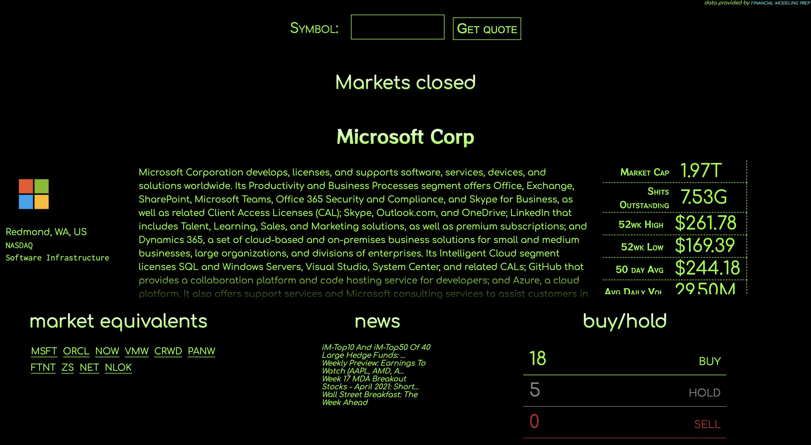

# React_Graph

<!-- PROJECT LOGO -->
<br />
<p align="center">
  <a href="https://github.com/jazznerd206/React_Graph">
    
  </a>

  <h3 align="center">Stocker</h3>

  <p align="center">
    Stonks go up 🚀🚀🚀
    <br />
    <a href="https://github.com/jazznerd206/React_Graph"><strong>DD »</strong></a>
    <br />
    <br />
    <a href="https://github.com/jazznerd206/React_Graph">View Demo</a>
    ·
    <a href="https://github.com/jazznerd206/React_Graph/issues">Report Bug</a>
    ·
    <a href="https://github.com/jazznerd206/React_Graph/issues">Request Feature</a>
  </p>
</p>

<!-- TABLE OF CONTENTS -->
<details open="open">
  <summary><h2 style="display: inline-block">Table of Contents</h2></summary>
  <ol>
    <li>
      <a href="#about-the-project">About The Project</a>
      <ul>
        <li><a href="#built-with">Built With</a></li>
      </ul>
    </li>
    <li>
      <a href="#getting-started">Getting Started</a>
      <ul>
        <li><a href="#prerequisites">Prerequisites</a></li>
        <li><a href="#installation">Installation</a></li>
      </ul>
    </li>
    <li><a href="#usage">Usage</a></li>
    <li><a href="#roadmap">Roadmap</a></li>
    <li><a href="#contributing">Contributing</a></li>
    <li><a href="#license">License</a></li>
    <li><a href="#contact">Contact</a></li>
    <li><a href="#acknowledgements">Acknowledgements</a></li>
  </ol>
</details>

<!-- ABOUT THE PROJECT -->

## About The Project

[Stocker](https://jazznerd206.github.io/React_Graph.com)

### Built With

- [ReactJS](https://reactjs.org/)
- [Create React App](https://create-react-app.dev/)
- [Financial Modeling Prep API](https://financialmodelingprep.com/developer/docs/)
- [FinnHub API/Websockets](https://finnhub.io/docs/api/introduction)

<!-- GETTING STARTED -->

## Getting Started

To get a local copy up and running follow these simple steps.

### Prerequisites

- npm
  ```sh
  npm i npm@latest -g
  ```

### Installation

1. Clone the repo
   ```sh
   git clone https://github.com/jazznerd206/React_Graph.git
   ```
2. Navigate to react app directory
   ```sh
   cd graph
   ```
3. Install NPM packages
   ```sh
   npm i
   ```

<!-- USAGE EXAMPLES -->

## Usage

As of the latest update, Stocker is a real time stock tracking application. Using the symbol search field, users can search valid stock symbols to return data about the company including basic biographical information, current news, financial health markers, current price and volume and analyst ratings.

> FEATURE ONE: THE SEARCH TRIE
> 

- Using a custom made m-ary prefix tree (Trie), the search field will return results in a dropdown for all symbols starting with the prefix value. IE typing 'M' into the symbol field will populate a dropdown with all symbols available starting with 'M'. Currently a naive implementation using a pre-made array of symbols, will update to CSV when available.

<!-- ROADMAP -->

## Roadmap

See the [open issues](https://github.com/jazznerd206/React_Graph/issues) for a list of proposed features (and known issues).

<!-- CONTRIBUTING -->

## Contributing

Contributions are what make the open source community such an amazing place to be learn, inspire, and create. Any contributions you make are **greatly appreciated**.

1. Fork the Project
2. Create your Feature Branch (`git checkout -b feature/AmazingFeature`)
3. Commit your Changes (`git commit -m 'Add some AmazingFeature'`)
4. Push to the Branch (`git push origin feature/AmazingFeature`)
5. Open a Pull Request

<!-- LICENSE -->

## License

Distributed under the Unlicense. See `LICENSE` for more information.

<!-- CONTACT -->

## Contact

-> add persons of contact here
Project Link: [https://github.com/jazznerd206/React_Graph](https://github.com/jazznerd206/React_Graph)

<!-- ACKNOWLEDGEMENTS -->

## Acknowledgements
